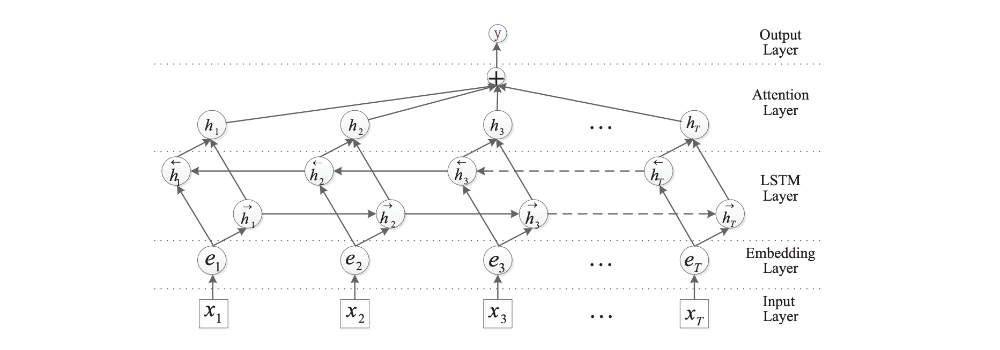

# Bi-LSTM + Attention

This folder contains the implementation of Attention-Based Bi-LSTM proposed in paper:

**Attention-Based Bidirectional Long Short-Term Memory Networks for Relation Classification.** *Peng Zhou, et al.* ACL 2016. [[Paper]](https://www.aclweb.org/anthology/P16-2034.pdf)

&nbsp;

## Overview

- It uses **element-wise sum** (instead of concatenation) to combine the forward and backward pass outputs of bidirectional LSTM.

&nbsp;

## Performance

|    Dataset    | Test Accuracy (%) | Training Time per Epoch (GTX 2080 Ti) |
| :-----------: | :---------------: | :-----------------------------------: |
|    AG News    |       92.0        |                  50s                  |
|    DBpedia    |       99.0        |                 105s                  |
| Yahoo Answers |       73.5        |                 3.4m                  |
